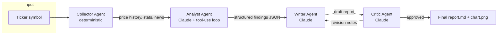

# Multi-Agent Stock Research Pipeline

A small pipeline of four cooperating Claude agents that turns a stock
ticker into a written research report — real price data, real news, and an
agent that decides for itself what to investigate before writing anything.

```bash
python main.py --ticker AAPL
```

## Why this project exists

This is a portfolio piece built to demonstrate, in one small and fully
readable codebase:

- **Real agentic tool use** — the Analyst agent isn't handed pre-computed
  answers. It gets a toolbox (price stats, custom moving averages,
  volatility, news, raw closes) and decides which tools to call, in what
  order, based on what it finds. See [`agents/analyst.py`](agents/analyst.py).
- **Multi-agent orchestration with a reflection loop** — a Critic agent
  fact-checks the Writer's draft against the underlying data and can send
  it back for one revision. This is the "agent checks agent" pattern used
  in production systems to catch hallucinated numbers before a human sees
  them. See [`agents/critic.py`](agents/critic.py).
- **Data engineering, not just prompting** — price history, moving
  averages, volatility, and chart generation are plain, independently
  tested Python (`core/tools.py`), not left to the model to compute or
  hallucinate.
- **Agentic code that's actually testable** — the full four-agent flow has
  an integration test that runs offline against a fake LLM client (no API
  key, no network, no flakiness) alongside unit tests for the deterministic
  data layer. See [`tests/`](tests/).

## Architecture



| Agent | Type | Job |
|---|---|---|
| **Collector** | Deterministic Python | Fetches price history + news via `yfinance`, computes stats. No LLM — this is the ETL layer. |
| **Analyst** | Claude, agentic tool-use loop | Investigates the data with its own tool calls, produces structured findings (trend, volatility, risks, opportunities). |
| **Writer** | Claude, one-shot | Turns structured findings + raw stats into a polished Markdown report. |
| **Critic** | Claude, one-shot | Fact-checks the draft against source data; approves or sends it back with specific revision notes. |

The orchestrator (`core/orchestrator.py`) owns the shared context object and
control flow — including the one-revision-max loop between Writer and
Critic — but does no reasoning itself. Each agent is a small, independently
testable unit.

## Setup

```bash
python3 -m venv .venv
source .venv/bin/activate        # Windows: .venv\Scripts\activate
pip install -r requirements.txt

cp .env.example .env
# then edit .env and set ANTHROPIC_API_KEY=sk-ant-...
```

## Usage

```bash
python main.py --ticker AAPL
python main.py --ticker MSFT --period 1y --output-dir ./output
python main.py --ticker TSLA --quiet     # suppress the step-by-step trace
```

Running it prints a live trace of what each agent is doing, including every
tool call the Analyst makes:

```
[1/4] Collector — fetching AAPL price history & news (6mo)...
      2025-03-18 -> 2025-09-17, +18.42%, 8 news items
      chart saved -> output/AAPL_chart.png

[2/4] Analyst — investigating with tool-use loop...
      -> called get_price_summary()
      -> called get_moving_averages(windows=[10, 20, 50])
      -> called get_news()
      trend: uptrend

[3/4] Writer — drafting report...

[4/4] Critic — reviewing draft against source data...
      approved on first pass

Done. Report -> output/AAPL_report.md
```

Output: `{TICKER}_report.md` (Markdown research note) and
`{TICKER}_chart.png` (price + moving averages) in the output directory.

## Testing

```bash
pip install -r requirements-dev.txt
python -m pytest tests/ -v
```

Two layers, both runnable with **no API key and no network access**:

- `tests/test_tools.py` — unit tests for the deterministic data layer
  (stats math, moving averages, volatility, news parsing across yfinance's
  old and new payload shapes, chart file generation).
- `tests/test_orchestrator_integration.py` — the full Collector → Analyst →
  Writer → Critic flow exercised against a fake Anthropic client with
  canned tool-use responses, including the revision-loop path where the
  Critic rejects a draft. yfinance calls are mocked with synthetic data.

## Design decisions

- **Why is the Collector not an LLM agent?** Fetching and computing stats
  is a solved, deterministic problem — adding an LLM there would only add
  cost and non-determinism. Reasoning agents (Analyst, Writer, Critic) are
  reserved for the parts of the pipeline that actually need judgment.
- **Why give the Analyst tools instead of just handing it all the data?**
  Because the interesting part of "agentic" is the model deciding what it
  needs, not passively summarizing a data dump. It can, for example, pull a
  10-day moving average instead of the default 20/50 if recent price action
  looks noisy — a static script can't do that.
- **Why a Critic instead of just trusting the Writer's output?** LLMs
  writing prose from structured data will occasionally introduce a number
  that doesn't match the source. A cheap second pass that reads the draft
  against the source data and can request one specific revision catches
  this class of error without a full human review step.

## Possible extensions

- Swap the Collector's data source for a different domain (SEC filings,
  GitHub repo activity, a support-ticket queue) — the Analyst/Writer/Critic
  pattern is domain-agnostic.
- Add a `search_web` tool to the Analyst so it isn't limited to yfinance's
  bundled headlines.
- Persist each run's full agent trace (tool calls, intermediate JSON) for
  auditability.

## Tech stack

Python 3.9+, [Anthropic SDK](https://github.com/anthropics/anthropic-sdk-python)
(Claude Sonnet), `yfinance`, `pandas`, `matplotlib`, `pytest`.

## License

MIT
